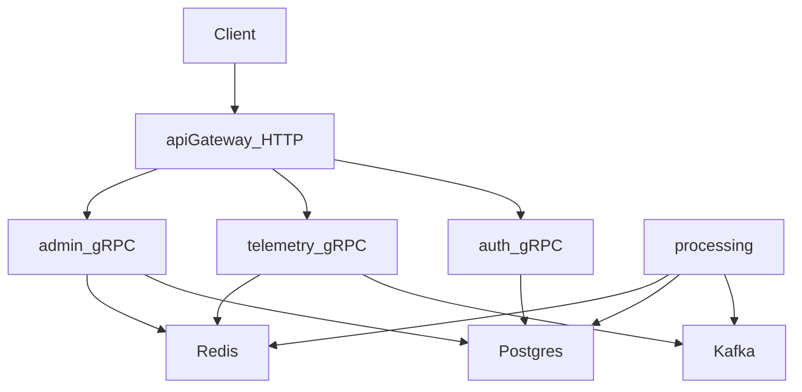

# CityDrive

CityDrive — учебный проект микросервисной платформы для приема телеметрии автомобилей, вычисления нарушений/событий и предоставления данных через API.

## Сервисы

- `api-gateway`: HTTP API, проксирует запросы в gRPC сервисы, валидирует JWT.
- `auth`: gRPC сервис аутентификации и регистрации пользователей, работает с PostgreSQL.
- `telemetry`: gRPC сервис приема телеметрии автомобиля, пишет актуальное состояние в Redis и публикует события в Kafka.
- `processing`: сервис обработки телеметрии из Kafka, сохраняет историю в PostgreSQL и обновляет текущие состояния в Redis.
- `admin`: gRPC сервис админских запросов (текущее состояние/история), читает из PostgreSQL и Redis.

Инфраструктура:

- PostgreSQL
- Redis
- Kafka + Zookeeper
- (опционально) pgAdmin

## Архитектура



## Быстрый старт (Docker Compose)

1) Создай файл `deployments/.env` на основе шаблона:

- скопируй `deployments/.env.example` → `deployments/.env`
- задай `JWT_SECRET_KEY` и `JWT_CAR_SECRET_KEY`

2) Запусти стек:

```bash
docker compose -f deployments/docker-compose.yml --env-file deployments/.env up --build
```

3) Проверки:

- `api-gateway`: `http://localhost:8080/health`
- `processing` (health): `http://localhost:8083/health/liveness`
- pgAdmin (если нужен): `http://localhost:8081`

## Порты (по умолчанию)

- `api-gateway`: `8080` (HTTP)
- `auth`: `50051` (gRPC внутри docker сети)
- `telemetry`: `50052` (gRPC внутри docker сети)
- `admin`: `50053` (gRPC внутри docker сети)
- `processing`: `8083` (HTTP health)
- `postgres`: `5432`
- `redis`: `6379`
- `kafka`: `9092` (хост), `9092` внутри docker сети через `kafka:9092`

## Конфигурация

Шаблоны лежат в `.env.example`:

- `deployments/.env.example` — единый набор переменных для docker-compose
- `api-gateway/.env.example`, `auth/.env.example`, `telemetry/.env.example`, `admin/.env.example`, `processing/.env.example` — примеры для локального запуска конкретного сервиса

Реальные `.env` игнорируются (см. `.gitignore`).

## Миграции

SQL миграции лежат в `migrations/`. В docker-compose используется контейнер `migrate`, который применяет миграции к PostgreSQL при старте.

## Прото/генерация

- исходники: `proto/**`
- сгенерированные файлы: `gen/proto/**`

## Структура репозитория

- `deployments/` — docker-compose и конфигурация окружения
- `migrations/` — миграции PostgreSQL
- `proto/` — protobuf контракты
- `gen/` — сгенерированный gRPC код
- `pkg/` — общие пакеты (логгер и т.п.)
- сервисы: `api-gateway/`, `auth/`, `telemetry/`, `admin/`, `processing/`
